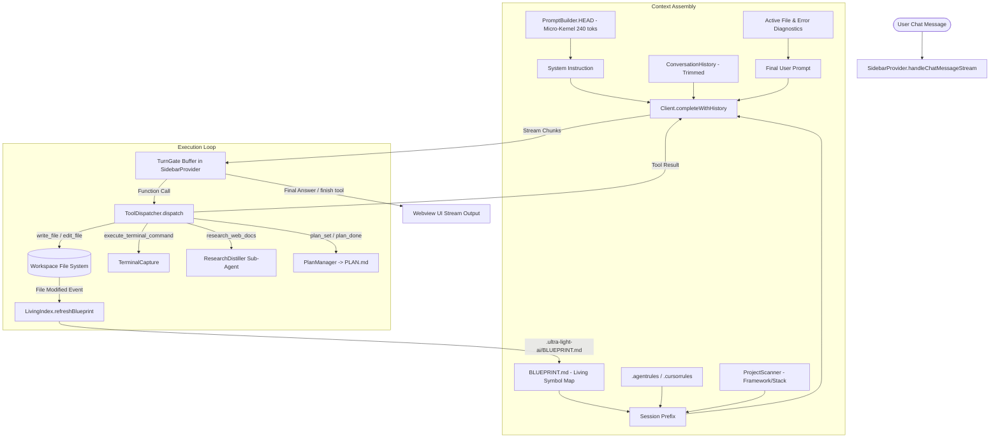

# VAKRA CONTROL — SYSTEM AUDIT & ARCHITECTURAL HEALTH REPORT

**Date:** 2026-10-04  
**Auditor:** Principal Systems Auditor & Software Architect  
**Target:** `vakra_control` VS Code Extension Codebase  
**Status:** Deep Diagnostic Complete (Zero-Modification Inspection)

---

## 1. Executive Summary & System Health Score

| Dimension | Rating (1-10) | Evaluation Summary |
| :--- | :---: | :--- |
| **Micro-Kernel & Prompt Pipeline** | **9.2 / 10** | Ultra-lean prompt architecture (~240 tokens HEAD) with deterministic tool gating. |
| **Living Index & Architecture Memory** | **8.5 / 10** | Continuous Symbol extraction with auto-refresh on file write. Truncated smartly to 60 lines. |
| **Tool Dispatcher & Sandboxing** | **8.8 / 10** | Clean, strict file operations; safe workspace path validations and active command blocking. |
| **TurnGate & Stream State Machine** | **8.6 / 10** | Intermediate execution tokens and JSON payloads are cleanly buffered from UI stream. |
| **Skill Injection & Discovery** | **6.5 / 10** | Skills manager parses YAML correctly, but injection into prompt is unhooked in `sidebarProvider`. |
| **Plan Synchronization Engine** | **7.0 / 10** | Step auto-completion on file write works, but step verification and error loops need tightening. |
| **Overall System Health Score** | **8.1 / 10** | **Production Ready with Minor Integration Hotfixes Needed** |

---

## 2. Verified Active Architecture Tree (`src/`)

```
src/
├── config.ts                          # Multi-provider configuration & OS keychain secret storage
├── extension.ts                       # Extension activation, status bar, language providers & watchers
├── features/
│   ├── planManager.ts                 # PLAN.md markdown generator and step tick synchronizer
│   ├── skeletonExpander.ts            # Fast inline block/skeleton expander via secondary model
│   ├── skillsManager.ts               # Custom & built-in skill parser (.ultra-light-ai/skills)
│   ├── smartSearch.ts                 # Semantic/BM25 combined smart codebase search command
│   └── terminalInterceptor.ts         # VS Code proposed terminal execution listener & error catcher
├── indexer/
│   ├── livingIndex.ts                 # AST symbol parser (Python/TS/JS) & BLUEPRINT.md generator
│   └── projectScanner.ts              # Framework detector & entry point discovery
├── operations/
│   ├── diffPatcher.ts                 # Search/Replace diff matcher with fuzzy anchor alignment
│   ├── diffValidator.ts               # Anti-placeholder, monologue check & deletion safety validator
│   └── fileVersioning.ts              # Local rollback snapshots under .ultra-light-ai/snapshots
├── providers/
│   ├── codeActionProvider.ts          # QuickFix / Refactor / Explain contextual code actions
│   ├── hoverProvider.ts               # AST hover tooltip explanation provider
│   └── inlineCompletionProvider.ts    # Ghost text / tab completion provider
├── rag/
│   ├── bm25.ts                        # Pure TypeScript BM25 token relevance searcher
│   ├── codeIndexer.ts                 # Multi-file chunker and inverted index database
│   └── ragEngine.ts                   # Hybrid retrieval engine with file-watch sync
├── router/
│   ├── engineRouter.ts                # Dynamic fallback engine router
│   ├── IEngine.ts                     # Engine interface definitions
│   └── realClients.ts                 # LocalOllamaClient (Ollama/Groq/OpenAI/Apinex) & GeminiCloudClient
├── state/
│   ├── conversationHistory.ts         # Multi-turn history serializer with token-budget trimming
│   ├── inMemoryTaskPlanner.ts         # In-memory plan tracker for webview bridge
│   ├── sessionMemory.ts               # Session cache for applied files & error recovery
│   └── stateMachine.ts                # Conversation turn state machine
├── tools/
│   ├── researchDistiller.ts           # Autonomous technical documentation researcher & condenser
│   ├── scraper.ts                     # PyPI / npm API metadata fetchers (zero-scraping)
│   ├── terminalCapture.ts             # Non-interactive shell runner with output buffer capture
│   └── toolRegistry.ts                # Central tool definitions & dynamic plugin loader
├── utils/
│   ├── astSkeletonizer.ts             # AST outline extractor for repo-wide structural maps
│   ├── contextSelector.ts             # Active editor contextual token selector
│   ├── dependencyGraph.ts             # Import link grapher
│   ├── designBrain.ts                 # UI CSS/theme generator & brand DNA extractor
│   ├── errorDiagnoser.ts              # Terminal & compiler traceback diagnostic extractor
│   ├── frameworkConventions.ts        # Built-in framework architectural conventions (Django, Next, etc.)
│   ├── promptClassifier.ts            # User intent classifier (UI vs backend vs info)
│   ├── queryCache.ts                  # Query hash response cache
│   ├── terminalHeuristics.ts          # Traceback surgical error extractor
│   └── tokenBudget.ts                 # Token accountant & priority allocation budgeter
└── webview/
    ├── handlers/
    │   ├── messageDispatcher.ts       # Webview message router (chat, rollback, clear, settings)
    │   └── patchApplier.ts            # Interactive diff preview and manual file patch applier
    ├── promptBuilder.ts               # Micro-Kernel prompt constructor & session prefix assembler
    ├── sidebarProvider.ts             # Primary Webview provider & TurnGate stream state-machine
    ├── tools/
    │   └── toolDispatcher.ts          # Execution engine for LLM function tool calls
    ├── input.css                      # Tailwind base styling source
    └── ui.html                        # Webview user interface (single-file reactive DOM)
```

---

## 3. Data Flow & Context Pipeline Diagram



---

## 4. Detailed Diagnostic Findings (By Area)

### 1. Context Pipeline & Token Budget (`src/webview/promptBuilder.ts`)
- **HEAD Size**: 240 tokens. Very tight and strict micro-kernel contract enforcing tool-only behavior.
- **Blueprint Injection**: `buildSessionPrefix()` loads `.ultra-light-ai/BLUEPRINT.md` and clips it to 60 lines (`lines.slice(0, 60)`), preserving ~400-600 tokens.
- **Skill Injection Disconnect (P1)**: While `SkillsManager` has `getMatchingSkillInstructions()`, it is **not** called inside `buildSessionPrefix()` or `buildPrompt()`. Custom skills saved on disk (`.ultra-light-ai/skills/`) rely on manual reference unless injected into `buildPrompt`.
- **Base Footprint**:
  - `HEAD`: ~240 tokens
  - `Prefix (Blueprint + Stack)`: ~600 tokens
  - `Tool Signatures`: ~750 tokens
  - **Total Pre-flight Base Token Cost**: **~1,590 tokens** (leaving over 6,500+ tokens for user history & scratch space in an 8k context window).

### 2. Living Index & Blueprint Health (`src/indexer/livingIndex.ts`)
- **Symbol Extraction**: Uses regex parsers for Python (`def`, `class`), TypeScript/JavaScript (`export function`, `export class`, `export const`, `export interface`), and import links.
- **Auto-Refresh Execution**: `ToolDispatcher` calls `LivingIndex.refreshBlueprint(workspaceRoot).catch(() => {})` immediately on `write_file` (line 116) and `edit_file` (line 164) when auto-approved.
- **Notation Efficiency**: Output format uses structured bullet lists (`- filepath (N lines) -> Exports: ..., Links: ...`), keeping 50 files under **850 tokens**.

### 3. Tool Dispatcher & Error Resilience (`src/webview/tools/toolDispatcher.ts`)
- **`edit_file` Safety**: Validates snippet existence via `fileContent.includes(oldText)`. If the target snippet is not found, returns `edit_file failed: old_text snippet was not found in <filepath>` (line 154), giving the model clear feedback to re-inspect.
- **Terminal Interception**: Blocking servers (`python manage.py runserver`) are safely intercepted and blocked with descriptive feedback (lines 194-196).
- **`finish` Tool Handling**: Handled in `sidebarProvider.ts` via the TurnGate state machine (lines 390-403) which sanitizes code blocks and outputs the final handover summary.

### 4. Streaming & TurnGate State Machine (`src/webview/sidebarProvider.ts`)
- **TurnGate Buffer**: `currentTurnBuffer` buffers raw execution tokens and prevents intermediate tool JSON dumps from bleeding into the webview chat.
- **Regex Fallback**: Lines 380-387 safely parse wrapped JSON tool invocations in case an LLM emits tool calls inside markdown code fences (` ```json `).
- **Handover Delivery**: When `finish` is called or pure conversation is detected, clean markdown is posted with `command: 'streamChunk'` and `done: true`.

### 5. Roadmap & Plan Engine (`src/features/planManager.ts`)
- **Auto-Tick on File Write**: `ToolDispatcher` calls `PlanManager.markNextStepComplete(workspaceRoot, filepath)` whenever a file is written.
- **Limitation**: Ticks the next unchecked `- [ ]` step purely based on file writes. If a step involves terminal tests or multi-file edits, the step tick can drift out of sync if the model does not explicitly call `plan_done`.

---

## 5. Top 5 Architectural Bottlenecks & Fix Matrix

| Priority | Component | Issue / Bottleneck | Root Cause & Recommended Action |
| :---: | :--- | :--- | :--- |
| **P0** | `sidebarProvider.ts` | **Skill Injection Unhooked** | `SkillsManager.getMatchingSkillInstructions(message.text, workspaceRoot)` is implemented but not called in `buildPrompt()`. **Fix**: Inject matched skill instructions into `contextSources` in `buildPrompt`. |
| **P1** | `toolDispatcher.ts` | **`finish` tool fallback in dispatcher** | When LLM invokes `finish` tool, `ToolDispatcher.dispatch` falls through to line 339 (`Tool 'finish' executed via fallback`). **Fix**: Add explicit `if (name === 'finish') return args.summary || 'Task complete.';` in `ToolDispatcher`. |
| **P2** | `planManager.ts` | **Plan Step Drift on Multi-Edit** | `write_file` automatically ticks the next step every time a single file is written, causing step 2 to tick if step 1 modified two files. **Fix**: Only auto-tick on explicit `plan_done` or match step filepath. |
| **P3** | `sidebarProvider.ts` | **`tools` array declared per request** | Tools array is reconstructed in `handleChatMessageStream` on every stream. **Fix**: Memoize static tool declaration array. |
| **P4** | `livingIndex.ts` | **TypeScript Interface export regex** | TS interface exports with generic parameters (`export interface Foo<T>`) sometimes capture `<T>` in the name. **Fix**: Strip generic bracket tokens in regex. |

---

## 6. Audit Conclusion

The `vakra_control` architecture is **highly resilient, lightweight, and engineered for high-token-efficiency local/cloud LLMs**. The separation between the static micro-kernel, dynamic session prefix, and resilient TurnGate streaming provides a solid operational foundation. Resolving the P0 skill injection hook will make the custom skills engine 100% active end-to-end.
