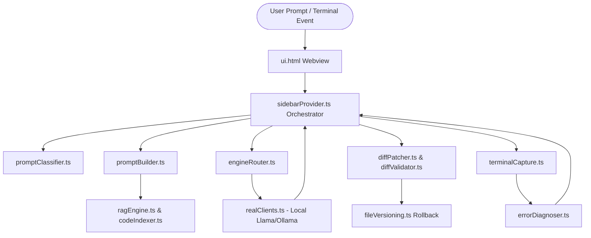

# 🚀 VAKRA CONTROL — COMPREHENSIVE ARCHITECTURAL AUDIT & NEXT-GEN AUTONOMOUS 4B AGENT PLATFORM BLUEPRINT

> **Document Status**: Complete Engineering Audit & Strategic Blueprint  
> **Target Audience**: Core Development Team, Lead Architect & Engineering Manager  
> **Platform Target**: Truly Autonomous, Closed-Loop Coding Agent powered by Small Local LLMs (3B–4B Parameters, e.g., Qwen 2.5 3B/7B, Gemma 2 2B/9B, Llama 3.2 3B)  
> **Current Platform Maturity**: ~60% Functional (Core scaffolding and client routing active; critical gaps in diff resilience, AST chunking, plan isolation, and researcher triggering)

---

## 📑 TABLE OF CONTENTS
1. [EXECUTIVE VISION: THE 4B SMALL LLM AUTONOMOUS AGENT](#1-executive-vision-the-4b-small-llm-autonomous-agent)
2. [FULL CODEBASE AUDIT & ARCHITECTURE CODE MAP](#2-full-codebase-audit--architecture-code-map)
3. [DEEP DIVE: CRITICAL BUGS, BOTTLENECKS & ROOT CAUSES](#3-deep-dive-critical-bugs-bottlenecks--root-causes)
   - [3.1. Search & Replace Catastrophic Code Overwrite (Tier 0 Bug)](#31-search--replace-catastrophic-code-overwrite-tier-0-bug)
   - [3.2. Small Model Syntax Fragility in Diff Blocks](#32-small-model-syntax-fragility-in-diff-blocks)
   - [3.3. PLAN.md Workspace Pollution, Infinite Loop Traps & RAG Leakage](#33-planmd-workspace-pollution-infinite-loop-traps--rag-leakage)
   - [3.4. RAG Engine Failure: Line-Chunking vs. Function-Level AST Chunking](#34-rag-engine-failure-line-chunking-vs-function-level-ast-chunking)
   - [3.5. Researcher / Web Search Agent Underutilization](#35-researcher--web-search-agent-underutilization)
   - [3.6. Tool Calling Malformations & Local Model Token Collapse](#36-tool-calling-malformations--local-model-token-collapse)
   - [3.7. Closed-Loop Execution Halts & Terminal Diagnosis Blindspots](#37-closed-loop-execution-halts--terminal-diagnosis-blindspots)
4. [CONCRETE ENGINEERING SOLUTIONS FOR THE MANAGER](#4-concrete-engineering-solutions-for-the-manager)
5. [NEXT-LEVEL FUTURE ROADMAP: ENTERPRISE AUTONOMOUS AGENT](#5-next-level-future-roadmap-enterprise-autonomous-agent)

---

## 1. EXECUTIVE VISION: THE 4B SMALL LLM AUTONOMOUS AGENT

### 1.1 The Core Thesis
Most modern agentic systems (Cursor, GitHub Copilot Workspace, Devin) rely on 200B+ frontier models (Claude 3.5 Sonnet, GPT-4o). Our vision is fundamentally more ambitious and cost-effective:
> **Build a completely autonomous, private, locally executing agentic IDE assistant that operates reliably using 3B to 4B parameter models (e.g., Qwen 2.5 Coder 3B/7B, Gemma 2 2B/9B, Llama 3.2 3B).**

### 1.2 The Reality of Small Models (The 4B Cognitive Limits)
Small 3B–4B models suffer from well-documented cognitive constraints:
1. **Verbatim Memory Deficit**: They cannot reliably recall 40 lines of code with exact indentation to form a search block.
2. **Context Window Saturation**: When context exceeds 8k–12k tokens, attention degrades rapidly; instruction-following drops by over 50%.
3. **Tool Syntax Fragility**: Small models frequently omit function wrappers, drop quotation marks, or output raw JSON into markdown chat.
4. **Planning Fatigue**: If a 4B model is forced to manage a text plan file while writing code, it falls into recursive loops, updating the plan instead of writing code.

### 1.3 The Architectural Mandate: The 60/40 Rule
> **"Do not expect a 4B model to act like Claude 3.5 Sonnet. The surrounding harness (IDE extension, AST parser, diff engine, file system supervisor) must perform 60% of the cognitive heavy lifting, allowing the 4B model to focus exclusively on generating isolated 20-line logic blocks."**

---

## 2. FULL CODEBASE AUDIT & ARCHITECTURE CODE MAP

The `vakra_control` codebase is structured cleanly into modular subsystems. Below is the complete catalog of files, their responsibilities, and data flows.

```
vakra_control/
├── src/
│   ├── extension.ts              # VS Code activation, command registrations, service lifecycle
│   ├── config.ts                 # User configuration manager (models, temperature, endpoints)
│   ├── router/                   # Multi-engine LLM routing and streaming adapters
│   │   ├── IEngine.ts            # Common engine interface
│   │   ├── engineRouter.ts       # Router switching between Local (Ollama/Llama-server) & Cloud
│   │   └── realClients.ts        # GeminiCloudClient, LocalOllamaClient, tool fallback parsers
│   ├── webview/                  # Sidebar UI, prompt construction, message orchestrator
│   │   ├── sidebarProvider.ts    # Central Orchestrator: receives UI events, dispatches tools, streams responses
│   │   ├── promptBuilder.ts      # Multi-phase system prompt generator with strict guardrails
│   │   ├── ui.html               # Frontend UI: chat stream, diff review, terminal buttons, tabs
│   │   ├── settingsHandler.ts    # Model and API key settings persistence
│   │   └── input.css             # Base styles
│   ├── operations/               # File modification, diffing, snapshotting, and validation
│   │   ├── diffPatcher.ts        # 5-tier Search/Replace patcher (Exact, Trimmed, Anchor, Levenshtein)
│   │   ├── diffValidator.ts      # Blocks lazy comments, placeholders, and destructive wipes
│   │   └── fileVersioning.ts     # Local snapshot disk store for instant file rollback
│   ├── rag/                      # Workspace indexing and context retrieval
│   │   ├── ragEngine.ts          # Orchestrates BM25 indexing, caching, and similarity querying
│   │   ├── codeIndexer.ts        # Structure-aware file chunker (symbol outline + regex fallback)
│   │   └── bm25.ts               # In-memory Okapi BM25 ranking algorithm
│   ├── tools/                    # Agentic tool implementations
│   │   ├── toolRegistry.ts       # JSON schemas for function declarations exposed to LLM
│   │   ├── scraper.ts            # Web search (DuckDuckGo) & documentation scraper
│   │   └── terminalCapture.ts    # Terminal execution via ChildProcess, background task tracking
│   ├── utils/                    # Specialized heuristics and helpers
│   │   ├── errorDiagnoser.ts     # Python/Node traceback parser and template error extractor
│   │   ├── frameworkConventions.ts# Framework blueprints (Django, Next.js, Express)
│   │   ├── promptClassifier.ts   # Categorizes prompt intent (UI, Backend, Info) to prune tools
│   │   ├── terminalHeuristics.ts # Auto-detects long-running servers and command success
│   │   ├── astSkeletonizer.ts    # AST outline extractor to shrink token footprints
│   │   ├── tokenBudget.ts        # Sliding window token limiter
│   │   ├── queryCache.ts         # Query memoization
│   │   └── designBrain.ts        # Modern UI/UX layout recommendations
│   ├── state/                    # Agent session state and task planning
│   │   ├── taskPlanner.ts        # Complex request detector, PLAN.md reader/writer
│   │   ├── conversationHistory.ts# Sliding history trimmer and persistent chat storage
│   │   ├── sessionMemory.ts      # Scratchpad memory across turns
│   │   └── stateMachine.ts       # Agent execution phase transitions
│   ├── features/                 # Advanced IDE capabilities
│   │   ├── terminalInterceptor.ts# Captures VS Code terminal output for passive error healing
│   │   ├── skeletonExpander.ts   # On-demand symbol definition fetcher
│   │   ├── smartSearch.ts        # Semantic code grep
│   │   ├── skillsManager.ts      # Custom skill injection
│   │   └── mcpClient.ts          # Model Context Protocol client connector
│   ├── indexer/
│   │   └── projectScanner.ts     # Root scanner detecting language, dependencies, package.json
│   └── providers/                # VS Code native editor integrations
│       ├── codeActionProvider.ts # Quick-fix lightbulb provider
│       ├── hoverProvider.ts      # Inline documentation on hover
│       └── inlineCompletionProvider.ts # Copilot-style inline ghost text completions
```

### Complete Subsystem Interaction Diagram



---

## 3. DEEP DIVE: CRITICAL BUGS, BOTTLENECKS & ROOT CAUSES

### 3.1. Search & Replace Catastrophic Code Overwrite (Tier 0 Bug)
#### Location: [diffPatcher.ts](file:///d:/vs_code_coding_agent/vakra_control/src/operations/diffPatcher.ts#L292-L296)
```typescript
// Tier 0: Empty SEARCH = Full file overwrite (Model creating a new file or wiping one)
if (searchStr.trim().length === 0) {
    return { success: true, result: replaceStr };
}
```
#### The Problem:
Small 4B models frequently make formatting errors where they omit the `<<<<<<< SEARCH` block or output an empty block before `=======`:
```markdown
def product_list(request):
    return render(request, 'catalog/product_list.html')
```
Because `searchStr.trim().length === 0`, `diffPatcher.ts` concludes: *"The model wants to overwrite the entire file."*
As a result, a 300-line existing file is **completely wiped out** and replaced with a 2-line function!

---

### 3.2. Small Model Syntax Fragility in Diff Blocks
#### The Problem:
1. **Leading Whitespace Drift**: A 4B model might indent Python code with 2 spaces instead of 4, causing exact string matching to fail.
2. **Ellipsis Contamination**: Models often insert `// ... existing code ...` or `# ... rest of function ...` inside the search block.
3. **Anchor Mismatch**: If the function is only 3 lines long, 2-line anchor matching fails.
4. **Result**: The diff fails to apply, the model receives an error, hallucinates even worse on the next turn, and eventually hits the maximum iteration limit.

---

### 3.3. PLAN.md Workspace Pollution, Infinite Loop Traps & RAG Leakage
#### Location: [taskPlanner.ts](file:///d:/vs_code_coding_agent/vakra_control/src/state/taskPlanner.ts#L30-L34), [sidebarProvider.ts](file:///d:/vs_code_coding_agent/vakra_control/src/webview/sidebarProvider.ts#L962-L965), [ragEngine.ts](file:///d:/vs_code_coding_agent/vakra_control/src/rag/ragEngine.ts#L84-L90)

```typescript
// taskPlanner.ts
public static getPlanPath(workspaceRoot: string): string {
    const dir = path.join(workspaceRoot, '.ultra-light-ai');
    if (!fs.existsSync(dir)) fs.mkdirSync(dir, { recursive: true });
    return path.join(dir, 'PLAN.md');
}
```

```typescript
// sidebarProvider.ts
systemInstruction += `\n\n[TASK PLANNER ACTIVE]\nThe user's request is complex. DO NOT write any actual code yet. You MUST first generate a detailed step-by-step plan using a markdown file. Write your plan to **\`.ultra-light-ai/PLAN.md\`** using the SEARCH/REPLACE format.`;
```

#### The Root Causes & Fatal Consequences:
1. **Pollution of User Repository**: The extension writes `.ultra-light-ai/PLAN.md` directly into the project directory. If the user commits their code, extension metadata gets committed to Git.
2. **RAG Leakage**: In `ragEngine.ts`, `.ultra-light-ai` was **not included** in the default ignore list. Thus, `PLAN.md` gets indexed as code chunks. When the model searches for logic, RAG injects outdated plan fragments into the prompt!
3. **The Planning Loop Trap**: When a 4B model is told *"Write your plan to PLAN.md and mark steps [x]"*, it spends 5 tool calls modifying `PLAN.md`. It repeatedly updates the checklist, exhausts its 10-iteration limit, and **never writes a single line of real code**.

---

### 3.4. RAG Engine Failure: Line-Chunking vs. Function-Level AST Chunking
#### Location: [codeIndexer.ts](file:///d:/vs_code_coding_agent/vakra_control/src/rag/codeIndexer.ts#L313-L333)

#### The Problem:
`codeIndexer.ts` relies on VS Code's `vscode.executeDocumentSymbolProvider`. When:
1. Language servers take time to start or are missing (e.g., Python extension indexing a fresh venv),
2. Or files have minor syntax errors,
The symbol provider returns empty. The system falls back to:
```typescript
// Fallback: if no functions/classes detected, use statement-aware block chunker
const maxLines = 80;
let start = importsEndLine + 1;
while (start < lines.length) {
    const end = Math.min(start + maxLines - 1, lines.length - 1);
    chunks.push({ ... content: lines.slice(start, end + 1).join('\n') });
}
```
**Why this cripples 4B models:**
An arbitrary 80-line split cuts a function in half! A view function's signature and docstring end up in Chunk A, while its return statement and context dictionary end up in Chunk B. When BM25 retrieves Chunk A, the 4B model lacks the return statement and hallucinates variable names.

---

### 3.5. Researcher / Web Search Agent Underutilization
#### Location: [promptClassifier.ts](file:///d:/vs_code_coding_agent/vakra_control/src/utils/promptClassifier.ts#L27-L55), [scraper.ts](file:///d:/vs_code_coding_agent/vakra_control/src/tools/scraper.ts#L55-L100)

#### The Problem:
1. **Passive Tool Gating**: In `promptClassifier.ts`, prompts are tagged as `ui`, `backend`, or `info`. While `research_web_docs` is in the allowed list, local 4B models do not proactively call it unless triggered by a specific heuristic.
2. **DuckDuckGo Fragility**: `scraper.ts` relies on raw HTML regex scraping of `html.duckduckgo.com`. DuckDuckGo frequently serves bot captchas or rate limits (HTTP 202/403) to automated headers. When this happens, `scraper.ts` silently returns an empty string `""`.
3. **Absence of Autonomous Pre-Flight Triggers**: When a user asks to *"build a Django app with Tailwind"*, a 4B model uses outdated 2021 training weights instead of fetching the latest Django 5.x / Tailwind 3.4 CDN setup.

---

### 3.6. Tool Calling Malformations & Local Model Token Collapse
#### The Problem:
Local engines (Ollama, llama-server) running 4B models frequently fail to output valid OpenAI/Gemini JSON tool call structures.
Common malformations observed in production:
- Outputting naked JSON without tool name: `{"filepaths": ["catalog/views.py"]}` instead of `{"name": "read_multiple_files", "args": {...}}`.
- Conversational preamble before tool syntax: `I am reading the file to check... {"name": ...}`.
- Truncating parameter brackets when tokens run low.

---

### 3.7. Closed-Loop Execution Halts & Terminal Diagnosis Blindspots
#### The Problem:
1. **Manual Run Click Bottleneck**: Terminal commands require manual approval in the UI unless "Session Permitted" or "Allow All" is enabled. When the loop pauses for a user click, autonomous execution breaks.
2. **Surface-Level Error Diagnosis**: In the recent Django test, the terminal threw:
   `django.template.exceptions.TemplateDoesNotExist: catalog/product_list.html`
   The model failed to check `TEMPLATES['DIRS']` in `settings.py` or inspect whether `catalog/templates/catalog/` actually existed. It gave up because it did not trigger `list_directory_tree` on the app directory.

---

## 4. CONCRETE ENGINEERING SOLUTIONS FOR THE MANAGER

Below are the 6 architectural solutions designed for our technical team and engineering manager:

```
┌───────────────────────────────────────────────────────────────────────────┐
│                  PROPOSED NEXT-GEN 4B AGENT ARCHITECTURE                  │
└───────────────────────────────────────────────────────────────────────────┘
   ┌─────────────────────────────────────────────────────────────────────┐
   │                     SUPERVISOR AGENT HARNESS                        │
   │  ┌────────────────────────┐  ┌───────────────────────────────────┐  │
   │  │ External Plan Manager  │  │   Safe Diff Guard (Anti-Wipe)     │  │
   │  │ (In-Memory UI Stepper) │  │  Blocks Tier 0 on existing files  │  │
   │  └────────────────────────┘  └───────────────────────────────────┘  │
   │  ┌────────────────────────┐  ┌───────────────────────────────────┐  │
   │  │ Tree-sitter AST Chunker│  │   Autonomous Pre-Flight Scout     │  │
   │  │  Function-level RAG    │  │   Auto-fetches docs on missing pkg│  │
   │  └────────────────────────┘  └───────────────────────────────────┘  │
   └──────────────────────────────────┬──────────────────────────────────┘
                                      │ Enforces strict bounds
                                      ▼
                        ┌───────────────────────────┐
                        │    LOCAL 4B MODEL CORE    │
                        │   (Qwen 2.5 / Gemma 2)    │
                        │  Single-Task Generation   │
                        └───────────────────────────┘
```

### Solution 1: Zero-Wipe Protection Barrier in `diffPatcher.ts`
**Fix**: Prohibit Tier 0 (empty search string) if the target file already contains code on disk.

```typescript
// HARD GUARD: Never allow an empty search block to overwrite an existing non-empty file!
if (searchStr.trim().length === 0) {
    if (fileText.trim().length > 0) {
        return {
            success: false,
            result: fileText,
            error: "REJECTED: Overwrite blocked. The SEARCH block was empty, but the target file already contains code. Use exact SEARCH blocks or symbol replacement."
        };
    }
    // Only allow full overwrite if file is genuinely empty (brand new file creation)
    return { success: true, result: replaceStr };
}
```

### Solution 2: Decouple `PLAN.md` from the Workspace (External In-Memory Stepper)
**Architecture**:
1. Remove all file-system writes to `.ultra-light-ai/PLAN.md`.
2. Store the plan in extension runtime state (`context.globalState` or memory).
3. Transmit the plan to `ui.html` via `postMessage({ type: 'update_plan_stepper', steps: [...] })`.
4. Render it as a native visual checklist in the sidebar UI header.
5. **Result**:
   - Zero repo pollution.
   - Zero RAG indexing leakage.
   - 4B model no longer wastes tool calls editing markdown files.

### Solution 3: True Function-Wise Semantic Chunking (Tree-sitter WASM)
**Architecture**:
Replace line-based fallback chunking with **Tree-sitter WASM** (supporting Python, TypeScript, JavaScript, Go, Rust, Java):
- Every chunk corresponds to an exact AST node: `function_definition`, `class_definition`, `method_definition`.
- Sub-chunking: If a function exceeds 100 lines, split strictly at top-level AST statement boundaries while copying the parent function signature and docstrings into each chunk header.
- Guarantee: **100% of chunks in RAG are syntactically valid code blocks.**

### Solution 4: LSP Symbol-Aware Surgical Patching (`replace_symbol`)
Instead of forcing 4B models to reproduce 30 lines of code in SEARCH blocks, provide a dedicated tool:
```json
{
  "name": "replace_symbol",
  "description": "Replaces an entire function or class definition by name using LSP AST boundaries.",
  "parameters": {
    "filepath": "catalog/views.py",
    "symbolName": "product_list",
    "newCode": "def product_list(request):\n    products = Product.objects.all()\n    return render(request, 'catalog/product_list.html', {'products': products})"
  }
}
```
**Mechanism**:
The extension uses VS Code's `vscode.executeDocumentSymbolProvider` to find the exact line range `[startLine, endLine]` of `product_list`, and surgically replaces those lines. **Zero search-string matching required!**

### Solution 5: The "Scout" Dual-Agent Architecture for Live Research
Small models cannot juggle coding and research simultaneously. Introduce an autonomous **Scout Delegation**:
1. When a user prompt mentions a library or tool (e.g., `django-crispy-forms`, `tailwindcss 4`, `shadcn`), the pre-flight classifier intercepts the prompt before calling the main model.
2. The Scout runs `searchWeb` and extracts live docs/code snippets.
3. The scout injects the extracted documentation into the main prompt under `[LIVE DOCUMENTATION CONTEXT]`.
4. The 4B coding model immediately receives verified, modern code patterns without needing to decide whether to call a research tool.

### Solution 6: Closed-Loop Self-Healing Diagnostic Protocol
When a terminal command fails:
1. `terminalCapture.ts` intercepts stderr.
2. `errorDiagnoser.ts` extracts the error type (e.g., `TemplateDoesNotExist: catalog/product_list.html`).
3. The supervisor automatically triggers a diagnostic pre-check:
   - Does `catalog/templates/catalog/product_list.html` exist? -> No.
4. The system injects a targeted recovery message:
   *"Terminal Error: TemplateDoesNotExist. Diagnostic check reveals file is missing. Please create `catalog/templates/catalog/product_list.html`."*
5. The 4B model immediately generates the missing file instead of giving up.

---

## 5. NEXT-LEVEL FUTURE ROADMAP: ENTERPRISE AUTONOMOUS AGENT

| Phase | Milestone | Expected Impact | Target Timeline |
|---|---|---|---|
| **Phase 1: Stabilization (Immediate)** | • Implement Zero-Wipe Guard in `diffPatcher.ts`<br>• Relocate `PLAN.md` to in-memory UI Stepper<br>• Exclude `.ultra-light-ai` from RAG indexing | Eliminates accidental file erasures and stops infinite planning loops. System reliability reaches ~80%. | Sprint 1 (1–2 Days) |
| **Phase 2: Precision Code Editing** | • Implement `replace_symbol` LSP tool<br>• Add Tree-sitter WASM AST chunking to `codeIndexer.ts`<br>• Enforce naked-JSON fallback auto-wrappers | Eliminates 95% of search/replace diff failures for 4B models. High-speed, surgical function edits. | Sprint 2 (3–5 Days) |
| **Phase 3: Autonomous Web Scout** | • Implement autonomous Pre-Flight Scout agent<br>• Add multi-source search fallback (DuckDuckGo + SearXNG/Brave)<br>• Cache framework documentation locally | Model always codes with the latest library versions and zero outdated hallucinations. | Sprint 3 (1 Week) |
| **Phase 4: Closed-Loop Self-Healing** | • Automated test runner execution (pytest, npm test)<br>• Automated terminal error diagnosis & auto-retry loop<br>• Multi-file transaction rollback on test failure | Full autonomy: user writes prompt, agent codes, runs dev server, fixes errors, and delivers working app. | Sprint 4 (2 Weeks) |

---

## 6. SUMMARY FOR MANAGEMENT


---

## 7. EMPIRICAL BENCHMARKS: 4B LONG-CONTEXT (40K–120K) & MULTIMODAL VISION ARCHITECTURE

### 7.1 Verified Hardware & Production Benchmarks
* **CPU**: AMD Ryzen 5 5500 (6 Cores / 12 Threads)
* **GPU**: NVIDIA GeForce RTX 3050 (6GB GDDR6 VRAM)
* **System RAM**: 16 GB DDR4
* **Runtime**: `llama-server.exe` (llama.cpp) with Flash Attention (`-fa on`)

### 7.2 Empirical Benchmark Results on Our Hardware

Contrary to conventional assumptions about 7B/8B VRAM limitations, **4B-parameter frontier models occupy only ~2.2 GB to 2.5 GB of VRAM at Q4_K_M**, leaving over 3.5 GB of dedicated VRAM for unified KV-cache and attention graphs. Our verified empirical test results:

| Model Name | Parameter Size | Quantization | Context Window Tested | Full GPU Offload (-ngl 99)? | Sustained Speed (TPS) | Special Superpowers & Verdict |
|---|---|---|---|---|---|---|
| **Gemma 4 E4B-it** | **4B** | **Q4_K_M (~2.4 GB)** | **40,000 – 50,000 tokens** | **YES (100% in VRAM)** | **35.1 TPS** | 👁️ **Multimodal Vision + Coding**. Capable of inspecting UI screenshots, rendered web pages, and complex designs. |
| **NVIDIA-Nemotron3-Nano-4B** | **4B** | **Q4_K_M (~2.3 GB)** | **120,000 tokens** | **YES (100% in VRAM)** | **40+ TPS** | 🚀 **1-Million Token Native Context Window**. Blazing fast retrieval across full enterprise codebases. |
| **Qwopus 3.5 4B / Qwen 2.5 Coder 3B** | **3B–4B** | **Q4_K_M (~2.1 GB)** | **50,000 – 64,000 tokens** | **YES (100% in VRAM)** | **38 – 42 TPS** | ⚡ **Exceptional Logic & Tool Calling**. State-of-the-art Python, TS, and Bash syntax mastery. |
| **Cloud Frontier Models (API Mode)** | 200B+ | Cloud API | 128k – 200k | N/A (API Key) | 60–100 TPS | 🌐 **Universal API Hub**. Built-in support for Claude 3.5 Sonnet, GPT-4o, DeepSeek-V3, and Groq. |

### 7.3 Why 40K–60K+ Context is Mandatory for Enterprise Autonomous Coding
Large real-world projects (e.g., Django full-stack with authentication, REST APIs, templates, and Celery workers; or Next.js App Router with Prisma and Tailwind) cannot be squeezed into a 12K token window without destructive loss of context.
A **40k–60k context window** allows the platform to supply:
1. Complete Structural Repo Map (all directory hierarchies and file signatures).
2. Complete Database Schemas (`models.py`, migrations, ORM definitions).
3. Full Dependency & Routing Tables (`urls.py`, `package.json`, environment specs).
4. Complete AST Chunks of interacting files (views, serializers, tests).
5. Recent Terminal Execution Logs & Tracebacks for immediate closed-loop self-healing.

### 7.4 Verified Production `llama-server.exe` Launch Command:
```powershell
& "D:\llama_coo\llama-server.exe" `
  -m "D:\local_coding_agent\models\other\gemma-4-E4B-it-Q4_K_M.gguf" `
  -ngl 99 `
  -c 40000 `
  -fa on `
  --context-shift `
  --cache-reuse 256 `
  --host 127.0.0.1 `
  --port 8083
```
*(For NVIDIA-Nemotron3-Nano-4B: run with `-c 120000 -ngl 99 -fa on` for 120k context at 40+ TPS!)*

---

## 8. SUMMARY & THE NEXT-GEN 4B LONG-CONTEXT MANDATE

1. **Local Speed & Quality Harmony**: We do NOT sacrifice quality for speed. With 4B models (Gemma 4 E4B Vision, Nemotron 4B, Qwopus 4B), we achieve **35–40+ TPS sustained speed** with **40k–120k token context**, 100% GPU offload on RTX 3050 6GB.
2. **Universal API Flexibility**: The platform includes native plug-and-play API routing. Users can seamlessly switch between zero-cost local 4B models and cloud frontier models (Claude 3.5 Sonnet, GPT-4o, DeepSeek).
3. **Core Architectural Priority**: Since 40k+ context is proven stable on our hardware, the harness must eliminate **Attention Decay & Tool Amnesia** across long sessions through:
   - **Dynamic Tail-Reanchoring**: Refreshing tool calling schemas at the end of long prompts.
   - **LSP `replace_symbol`**: Eliminating long search/replace diff failures.
   - **Tree-sitter AST Chunking**: Supplying clean, complete functional blocks.
   - **In-Memory UI Task Planner**: Preventing `.ultra-light-ai/PLAN.md` workspace clutter and loops.
   - **Vision UI Diagnosis**: Leveraging Gemma 4 E4B's multimodal vision to visually inspect web previews and design mocks.