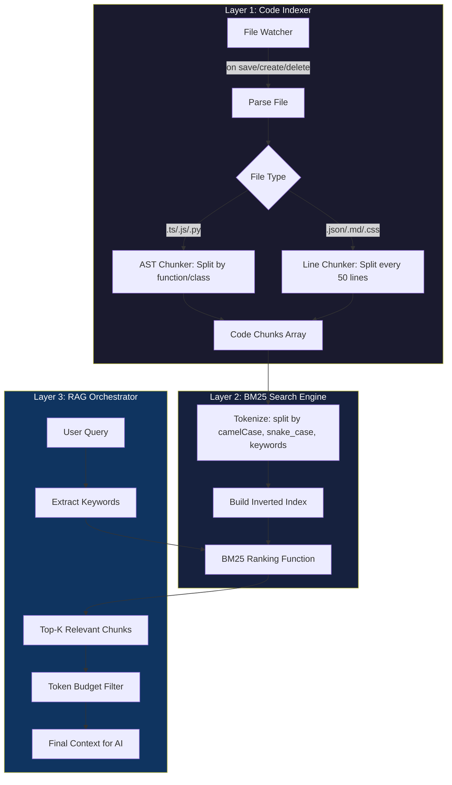
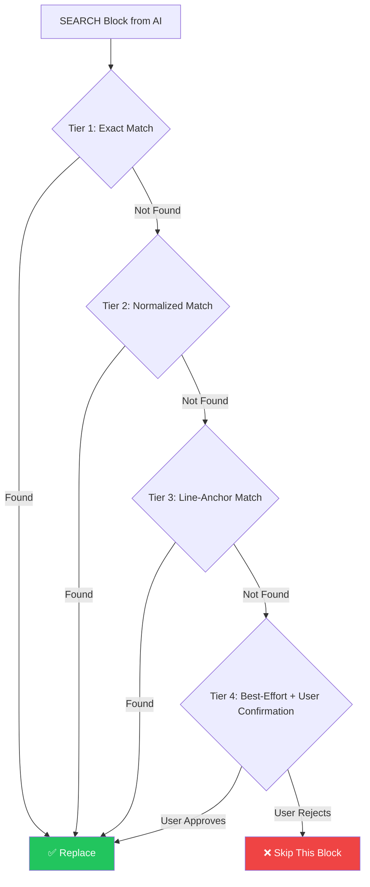

# 🏗️ Ultra Light AI — Final Architecture Plan v2.0
## Scalable Context Engine + Zero-Dependency RAG + Robust Code Patching

> **Goal:** Make the extension handle any project size (10 files or 1000 files) without token crashes, with intelligent semantic code retrieval, and reliable code patching.

---

## 📁 New File Structure After Implementation

```
src/
├── config.ts                          (MODIFY - split token settings)
├── extension.ts                       (MODIFY - init indexer on workspace open)
├── rag/                               (NEW - entire directory)
│   ├── codeIndexer.ts                 (NEW - AST-aware file chunker)
│   ├── bm25.ts                        (NEW - BM25 ranking algorithm)
│   └── ragEngine.ts                   (NEW - orchestrator: index + search + rank)
├── utils/                             (NEW - entire directory)
│   └── tokenBudget.ts                 (NEW - token estimation & budget allocation)
├── webview/
│   └── sidebarProvider.ts             (MODIFY - integrate RAG + budget + fix patching)
├── state/
│   └── conversationHistory.ts         (MODIFY - smarter trim)
└── ...existing files unchanged...
```

---

## 🔴 STEP 1: Token Budget Manager
**New file:** `src/utils/tokenBudget.ts`  
**Priority:** 🔴 CRITICAL (foundation for everything)  
**Effort:** Small

### What It Does
A pure utility module that estimates, allocates, and enforces token limits. Every other module will use this before injecting context.

### Key Design

```
┌─────────────────────────────────────────────┐
│           TOTAL TOKEN BUDGET                │
│           (e.g., 30,000 tokens)             │
├─────────────────────────────────────────────┤
│ System Prompt      │  ~600 tokens   (fixed) │
│ Chat History       │  ~2,000 tokens (flex)  │
│ RAG Context        │  ~4,000 tokens (flex)  │  
│ Active File        │  ~2,000 tokens (flex)  │
│ @file injections   │  ~3,000 tokens (flex)  │
│ @workspace tree    │  ~400 tokens   (fixed) │
│ User Message       │  ~1,000 tokens (flex)  │
│ ─────────────────────────────────────────── │
│ RESERVED FOR AI    │  remaining     (output)│
│ RESPONSE           │                        │
└─────────────────────────────────────────────┘
```

### Core Functions

```typescript
// Estimate tokens for a string (~4 chars per token)
estimateTokens(text: string): number

// Smart truncation: keep first N + last M lines, omit middle
truncateToTokens(text: string, maxTokens: number): string

// Allocate budget across multiple sources proportionally
allocateBudget(totalBudget: number, sources: { 
  name: string, content: string, priority: number 
}[]): { name: string, content: string, tokens: number }[]
```

### Smart Truncation Strategy
```
Original file (500 lines):
  Lines 1-60:   KEEP  (imports, class declarations, interfaces)
  Lines 61-440: SKIP  "... (380 lines omitted — ask for specific function) ..."
  Lines 441-500: KEEP (exports, main function calls)
```

---

## 🔴 STEP 2: Smart File Chunking
**Modify:** `src/webview/sidebarProvider.ts` → `buildPrompt()`  
**Priority:** 🔴 CRITICAL  
**Effort:** Medium

### Changes to `buildPrompt()`

| Current Behavior | New Behavior |
|---|---|
| `@file` injects entire file content without limit | `@file` truncated to budget allocation per file |
| `@workspace` sends only file names (useless for analysis) | `@workspace` sends file tree + first 3 lines of each key file |
| Active file auto-included on every message | Active file only when no `@file` or RAG context exists |
| No feedback on context size | Status update shows `📊 Context: 4,200/30,000 tokens` |
| Single file truncation at 15,000 chars (arbitrary) | Smart truncation: top + bottom + relevant functions |

### Two-Phase Workspace Analysis

**Phase 1 — Tree + Summary (cheap):**
```
When user says "analyze this project" or uses @workspace:
→ Scan all files
→ Send ONLY: file names + line counts + file sizes
→ Ask AI: "Based on this project structure, which files should I 
   load for a full analysis? List the top 10 most important files."
```

**Phase 2 — Targeted Deep Scan (smart):**  
```
AI responds with file list
→ Load only those 10 files (truncated to budget)
→ Re-prompt AI with actual code content
→ AI now has focused, high-quality context
```

This ensures even a 1000-file project uses only ~5,000 tokens for analysis.

---

## 🔴 STEP 3: Zero-Dependency RAG Engine (BM25 + Code Indexer)
**New files:** `src/rag/codeIndexer.ts`, `src/rag/bm25.ts`, `src/rag/ragEngine.ts`  
**Priority:** 🔴 CRITICAL  
**Effort:** Large (but high impact)

### Why RAG Instead of Dumping Everything?

| Without RAG | With RAG |
|---|---|
| User asks "fix the login bug" | User asks "fix the login bug" |
| System dumps ALL files → token crash | System searches index → finds `auth.ts`, `login.ts` |
| AI gets 50,000 tokens of irrelevant code | AI gets 3,000 tokens of relevant code |
| AI hallucinates or crashes | AI gives precise, accurate fix |

### Architecture: 3-Layer RAG



### Layer 1: Code Indexer (`codeIndexer.ts`)

**What it does:** Breaks source files into meaningful "chunks" — not random 50-line blocks, but actual functions, classes, and logical units.

**Chunking Strategy:**
```typescript
interface CodeChunk {
    id: string;              // unique identifier
    filepath: string;        // relative path from workspace root
    startLine: number;       // line number where chunk starts
    endLine: number;         // line number where chunk ends
    type: 'function' | 'class' | 'block' | 'imports' | 'exports';
    name: string;            // function/class name or "imports"
    content: string;         // actual code content
    tokens: string[];        // tokenized words for search
}
```

**How it chunks (TypeScript/JavaScript example):**
```
File: src/auth/loginService.ts (200 lines)
  → Chunk 1: "imports" (lines 1-8)         → 8 lines
  → Chunk 2: "class LoginService" (9-45)   → 36 lines  
  → Chunk 3: "function validateToken" (47-82)  → 35 lines
  → Chunk 4: "function refreshSession" (84-120) → 36 lines
  → Chunk 5: "exports" (195-200)           → 5 lines
```

**Regex-based chunking (no AST parser needed — zero dependency):**
```typescript
// Detect function/method boundaries:
const functionRegex = /^(\s*)(export\s+)?(async\s+)?function\s+(\w+)/gm;
const arrowFnRegex = /^(\s*)(export\s+)?(const|let|var)\s+(\w+)\s*=\s*(async\s+)?\(/gm;
const classRegex = /^(\s*)(export\s+)?(class|interface|type|enum)\s+(\w+)/gm;
```

### Layer 2: BM25 Search (`bm25.ts`)

**Why BM25?**
- Zero dependency (pure math formula)
- Used by Elasticsearch, Lucene, etc.
- Better than TF-IDF for code search
- ~50 lines of code total

**BM25 Formula (simplified):**
```
score(query, chunk) = Σ IDF(term) × (tf × (k1+1)) / (tf + k1 × (1 - b + b × |chunk|/avgLen))

Where:
  IDF = inverse document frequency (how rare is this term?)
  tf  = term frequency in this chunk
  k1  = 1.5 (saturation parameter)
  b   = 0.75 (length normalization)
```

**Code-aware tokenization:**
```typescript
// "getUserProfile" → ["get", "user", "profile"]
// "fetch_api_data" → ["fetch", "api", "data"]  
// "handleChatMessage" → ["handle", "chat", "message"]

function tokenize(text: string): string[] {
    return text
        .replace(/([a-z])([A-Z])/g, '$1 $2')  // camelCase split
        .replace(/[_\-\.]/g, ' ')               // snake_case split
        .toLowerCase()
        .split(/\s+/)
        .filter(t => t.length > 1);
}
```

### Layer 3: RAG Orchestrator (`ragEngine.ts`)

**What it does:** Ties everything together. When user sends a message:

```
1. User says: "fix the login bug where token expires"
2. RAG extracts keywords: ["fix", "login", "bug", "token", "expires"]
3. BM25 searches all chunks → ranks by relevance
4. Top 5-10 chunks selected (sorted by score)
5. Token Budget Manager truncates to fit budget
6. Final context injected into prompt
```

**User-facing trigger:**
```
@rag fix the login bug          ← Explicit RAG search
@smart analyze auth module      ← Same thing, different keyword
"find bugs in authentication"   ← Auto-detected (contains "bug"/"fix"/"error")
```

### Index Persistence

```
Workspace Root/
└── .ultra-light-ai/
    └── index.json              (Serialized BM25 index, ~50KB for 100 files)
```
- Rebuilt on workspace open (background, non-blocking)
- Updated incrementally on file save/create/delete
- `.ultra-light-ai/` added to `.gitignore` automatically

---

## 🔴 STEP 4: Fix Search/Replace Patching (4-Tier Matching)
**Modify:** `src/webview/sidebarProvider.ts` → `handleApplyWorkspaceEdits()`  
**Priority:** 🔴 CRITICAL  
**Effort:** Medium

### Current: 2-Tier (always fails)
```
Tier 1: Exact string match     → fails on whitespace
Tier 2: Trimmed match          → fails on indent changes
→ HARD ERROR
```

### New: 4-Tier (graceful degradation)



**Tier 1 — Exact Match (current):**
```typescript
if (fileText.includes(searchStr)) {
    fileText = fileText.replace(searchStr, replaceStr);
}
```

**Tier 2 — Normalized Match (new):**
```typescript
// Normalize both sides: collapse whitespace, trim each line
const normalizedFile = normalizeWhitespace(fileText);
const normalizedSearch = normalizeWhitespace(searchStr);
if (normalizedFile.includes(normalizedSearch)) {
    // Find original position and replace
}
```

**Tier 3 — Line-Anchor Match (new):**
```typescript
// Find the first line and last line of SEARCH in the file
// Replace everything between those anchors
const firstLine = searchStr.split('\n')[0].trim();
const lastLine = searchStr.split('\n').pop().trim();
const startIdx = findLineIndex(fileLines, firstLine);
const endIdx = findLineIndex(fileLines, lastLine, startIdx);
if (startIdx !== -1 && endIdx !== -1) {
    // Replace lines startIdx..endIdx with replaceStr
}
```

**Tier 4 — User Confirmation (new):**
```typescript
// Show VS Code diff editor with proposed changes
// User clicks "Accept" or "Reject"
const confirmed = await vscode.window.showWarningMessage(
    `Could not find exact match in ${filepath}. Apply best-effort patch?`,
    'Accept', 'Reject'
);
```

---

## 🟠 STEP 5: Context-Aware System Prompt
**Modify:** `src/webview/sidebarProvider.ts` → `buildSystemInstruction()`  
**Priority:** 🟠 HIGH  
**Effort:** Small

### Dynamic Context Header
Add to the system prompt at runtime:

```typescript
systemInstruction += `

CURRENT CONTEXT AVAILABLE TO YOU:
- Active File: ${activeFileName} (${activeFileLines} lines, ${activeFileLang})
- Referenced Files: ${fileCount} files loaded via @file
- RAG Results: ${ragChunkCount} relevant code chunks from workspace index
- Workspace: ${totalFiles} files in project (file tree available)
- Chat History: ${historyTurns} previous turns loaded

RULES:
1. When using Search/Replace blocks, copy the EXACT code from the 
   context provided above. Do NOT guess or paraphrase code.
2. If you cannot see the file content, ask the user to share it 
   using @file "path/to/file".
3. For large changes, break them into multiple Search/Replace blocks.
4. Always include the filepath header: **\`src/path/file.ext\`**
`;
```

---

## 🟡 STEP 6: Split Token Settings
**Modify:** `src/config.ts` → `AgentConfig`  
**Priority:** 🟡 MEDIUM  
**Effort:** Small

### Current (Conflated)
```json
{
    "contextLimits": {
        "maxTokens": 8000,        // Controls BOTH output AND context
        "historyLength": 10
    }
}
```

### New (Separated)
```json
{
    "contextLimits": {
        "maxOutputTokens": 8000,  // How long AI's reply can be
        "maxContextTokens": 30000, // How much context we assemble
        "historyLength": 10
    }
}
```

### Why This Matters
- Gemma 4 31B supports up to **131,072 tokens** input
- Setting `maxTokens: 6000` currently starves context AND output
- With separation: user can set low output (6000) but high context (30000)

---

## 🟢 STEP 7: Auto-Indexing on Workspace Open
**Modify:** `src/extension.ts`  
**Priority:** 🟢 LOW (polish)  
**Effort:** Small

### On Extension Activation
```typescript
// In activate():
const ragEngine = new RagEngine(workspaceRoot);
await ragEngine.buildIndex();  // Background, non-blocking

// Watch for file changes
const watcher = vscode.workspace.createFileSystemWatcher('**/*.{ts,js,py,java,go,rs,tsx,jsx,css,json}');
watcher.onDidChange(uri => ragEngine.updateFile(uri.fsPath));
watcher.onDidCreate(uri => ragEngine.addFile(uri.fsPath));
watcher.onDidDelete(uri => ragEngine.removeFile(uri.fsPath));
```

### Status Bar Integration
```
[🧠 RAG: 247 chunks indexed] ← Shows in status bar
```

---

## 📊 Final Priority & Effort Matrix

| Step | What | Priority | Effort | Files Touched |
|------|------|----------|--------|---------------|
| 1 | Token Budget Manager | 🔴 Critical | Small | NEW: `utils/tokenBudget.ts` |
| 2 | Smart File Chunking | 🔴 Critical | Medium | MOD: `sidebarProvider.ts` |
| 3 | RAG Engine (BM25) | 🔴 Critical | Large | NEW: `rag/codeIndexer.ts`, `rag/bm25.ts`, `rag/ragEngine.ts` |
| 4 | Fix Search/Replace | 🔴 Critical | Medium | MOD: `sidebarProvider.ts` |
| 5 | Context-Aware Prompt | 🟠 High | Small | MOD: `sidebarProvider.ts` |
| 6 | Split Token Settings | 🟡 Medium | Small | MOD: `config.ts`, `sidebarProvider.ts`, `ui.html` |
| 7 | Auto-Indexing Watcher | 🟢 Low | Small | MOD: `extension.ts` |

---

## 🚀 Execution Order

```
Step 1 (Token Budget)
  ↓
Step 2 (Smart Chunking) ←── uses Step 1
  ↓
Step 3 (RAG Engine) ←── uses Step 1 for budget
  ↓
Step 4 (Fix Patching) ←── independent but needs testing with RAG context
  ↓
Step 5 (Smart Prompt) ←── uses metadata from Steps 2+3
  ↓
Step 6 (Split Settings) ←── config refactor
  ↓
Step 7 (Auto-Index) ←── uses Step 3's engine
```

> [!IMPORTANT]
> Steps 1-4 are **CRITICAL** — without them the extension breaks on real projects.
> Steps 5-7 are **POLISH** — they make it professional but aren't blockers.

---

## ✅ Success Criteria

| # | Metric | Before | After |
|---|--------|--------|-------|
| 1 | Handle 100+ file project | ❌ Token crash | ✅ Smooth analysis |
| 2 | Code patching success rate | ~10% (exact match only) | ~90% (4-tier matching) |
| 3 | Context relevance | 0% (dump everything) | ~85% (RAG-selected) |
| 4 | Token waste | ~80% irrelevant context | <20% irrelevant context |
| 5 | Max project size | ~5 files before crash | 1000+ files supported |
| 6 | External dependencies for RAG | N/A | **ZERO** (pure TypeScript) |

---

## 💡 Key Design Decisions

1. **Zero-Dependency RAG:** We use BM25 (a mathematical formula) instead of vector embeddings. No ML models, no Python, no ONNX runtime. Pure TypeScript, ~200 lines total.

2. **Regex-Based Code Chunking:** Instead of a full AST parser (which needs `typescript` compiler API or `babel`), we use regex to detect function/class boundaries. It's 95% accurate and adds zero dependencies.

3. **Budget-First Architecture:** Every piece of context goes through the Token Budget Manager before reaching the prompt. This guarantees we NEVER exceed the model's limit.

4. **Graceful Degradation for Patching:** Instead of hard-failing when code doesn't match, we try 4 levels of matching and ultimately ask the user for confirmation.

> [!TIP]
> **Ready to implement?** Say "start step 1" and I'll write the code for `tokenBudget.ts`. We'll go step-by-step, testing each module before moving to the next.
